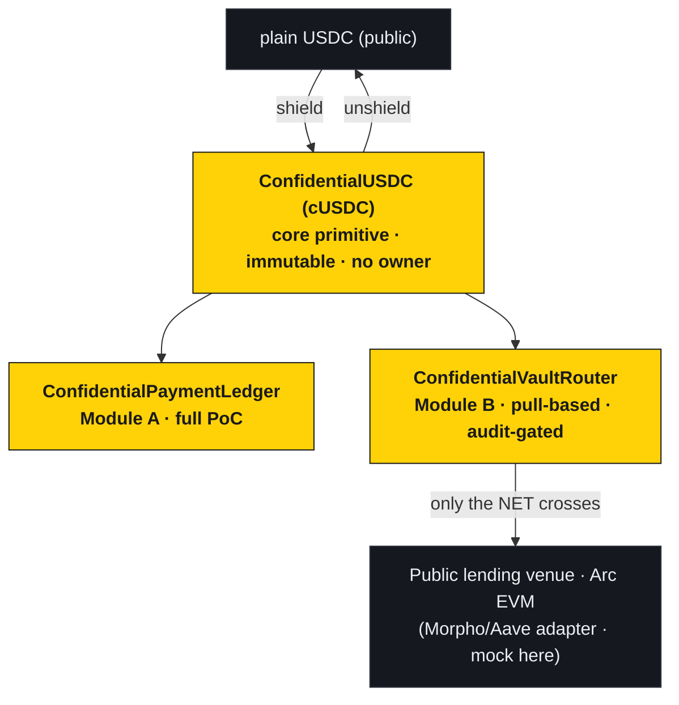
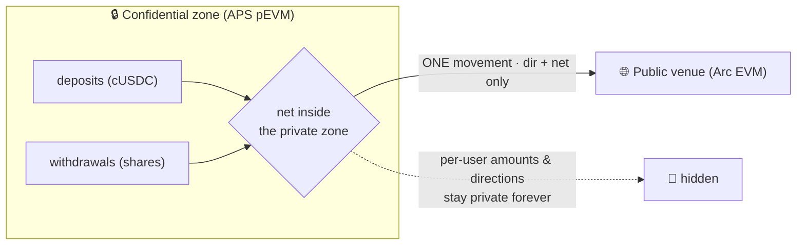
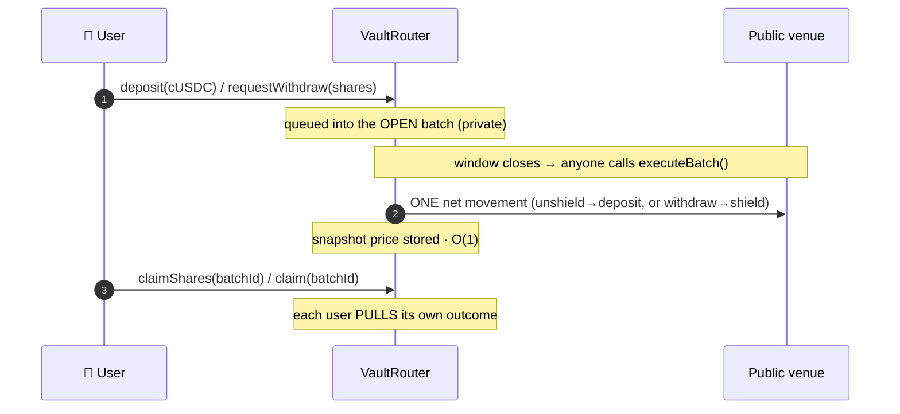
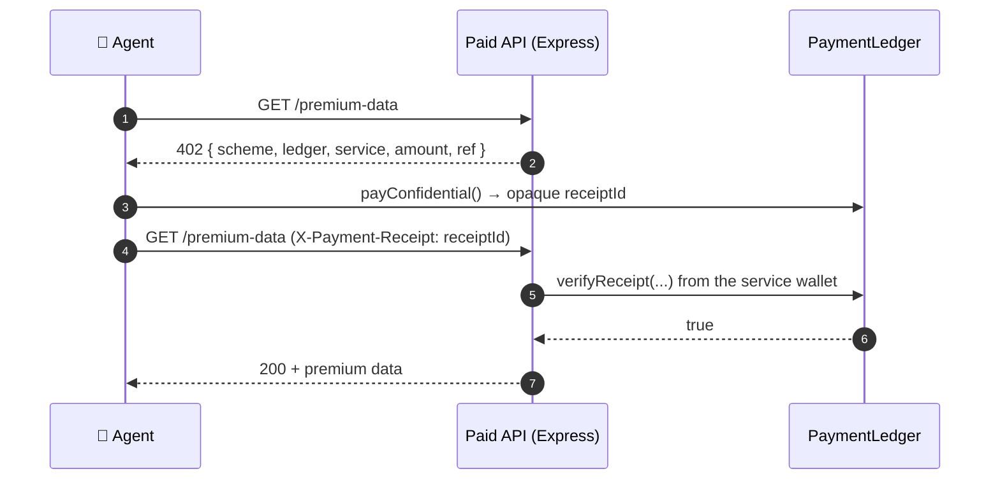

<div align="center">

# 👻 GhostRail

### A confidential lending layer for Circle's Arc — earn venue yield, keep your position private

**Supply into existing public lending venues (Morpho/Aave-style) across multiple asset markets — USDC · ETH · BTC · EURC · tokenized treasury — but keep your position private.** Only the _net_ of each batch ever touches the public venue. A confidential x402 / agent **payments** module ships alongside (secondary). Plain Solidity, USDC-native, architected for Arc's TEE Privacy Sector. **Live on Arc testnet.**

<br/>

[](https://docs.arc.network)
[](https://testnet.arcscan.app)
[](https://soliditylang.org/)

[](https://ghostrail-wine.vercel.app)
[](#-testing)
[](#-testing)
[-2775CA?style=flat-square)](https://faucet.circle.com)
[](#-sdk--the-402-flow)
[](./LICENSE)

**[🌐 Live Demo](https://ghostrail-wine.vercel.app) · [📜 Deployed contracts](#-deployed-contracts-arc-testnet) · [🧠 How it works](#-under-the-hood) · [🔒 Privacy model](#-whats-private-vs-public) · [🛰 Roadmap to APS](#-limitations--roadmap)**

</div>

---

> **Honest by design.** APS (Arc's TEE Privacy Sector) is **not live yet**, so on Arc testnet the confidentiality layer is **notional** — storage is readable and view-gating isn't enforced against `eth_call` spoofing. What **is** live: the protocol logic and a real USDC integration. We say *"protocol live on Arc testnet, USDC-integrated, architected for APS; confidentiality activates when APS ships."* We never claim the privacy is live. GhostRail applies proven confidential-DeFi patterns (netting, the two-speed boundary, honest boundary tables) on Arc's TEE substrate.
>
> **Circle integrations (genuinely live):** real Arc-testnet **USDC** (wrapped on the cUSDC market) · a real **CCTP** bridge (Circle's Bridge Kit — bring USDC from Base/Ethereum/Arbitrum Sepolia to Arc via burn→attestation→mint) · **EURC** as a market. These are real, distinct from the simulated lending venues; only the confidentiality is notional (pending APS).

---

## 📖 Table of contents

- [Why GhostRail](#-why-ghostrail)
- [Architecture — Arc is a dual EVM](#-architecture--arc-is-a-dual-evm)
- [The product](#-the-product)
- [Under the hood](#-under-the-hood)
- [Deployed contracts (Arc testnet)](#-deployed-contracts-arc-testnet)
- [SDK & the 402 flow](#-sdk--the-402-flow)
- [What's private vs public](#-whats-private-vs-public)
- [Security posture](#-security-posture)
- [Tech stack](#-tech-stack)
- [Local development](#-local-development)
- [Testing](#-testing)
- [Limitations & roadmap](#-limitations--roadmap)

---

## 💡 Why GhostRail

Every payment and every lending position an agent or institution makes on a public chain is a broadcast — the **amount**, the **counterparty**, the **timing**, the **position size**, all readable by anyone with an RPC endpoint. For the emerging **x402 / agent economy** settling in USDC on Arc, that's an operational-privacy hole baked into the rails.

GhostRail closes it as a **layer, not a venue**. One shared primitive — a confidential USDC wrapper with selective disclosure and a public solvency invariant — carries two modules:

> **Operational privacy, not a mixer.** We hide amounts, counterparties, internal breakdowns and the timing of an entity's own activity. We do **not** claim unlinkability. Shield/unshield amounts and aggregates are public by design — for solvency anyone can verify. This is what institutions actually buy.

---

## 🏛 Architecture — Arc is a dual EVM

The whole design turns on one fact: **Arc is not a monolithic private chain.** It is a **public Arc EVM** (where lending venues live) **plus** a **private APS pEVM** (where confidential accounting lives), bridged by a native shield/unshield with atomic same-block composability. Value crosses the boundary explicitly — which is exactly why **netting** at that boundary matters.





---

## 🔱 The product

| Layer | What it does | Status |
|---|---|---|
| **Confidential lending (HERO)** | One generic core — a confidential ERC20 wrapper (**any** asset) + a pull-based vault router — pools confidential deposits into an **existing public venue** across **5 asset markets** (cUSDC · cWETH · cWBTC · cEURC · cUSTB). Users hold confidential shares; only the batch **net** crosses the public boundary (GhostGate netting). Deposit/yield in v1; borrow is v3. | **Live on Arc** (USDC market real; others simulated) · audit-gated for real funds |
| **Confidential payments (secondary)** | A private account for the x402 / agent economy — fund once, pay many services with amounts + counterparties hidden; opaque receipts, gated verification, view-key audit, timing-decorrelated cash-out. | **Full working PoC** |

---

## 🧠 Under the hood

**One primitive.** `ConfidentialUSDC` wraps USDC 1:1 (`shield`/`unshield` at the public boundary), moves value privately inside the confidential zone (7984-style operator model), exposes a per-account **observer / view key**, and publishes `totalShielded` for a public **solvency invariant**. Immutable, no owner, no privileged fund path.

**Payments (Module A).** `pay()` is a pure internal-balance move — no cUSDC leaves the ledger, so payments are unobservable at the token layer. It emits only an **opaque `receiptId`** (a hash — no amount, no counterparty). A service verifies via its own gated `verifyReceipt`; an auditor reads a statement under a granted view key; cash-outs go through a **timing-decorrelation window** so a service's payout can't be linked to the payments that funded it.

**Vault Router (Module B) — pull-based, DoS-resistant.** `executeBatch()` does **O(1)** work: it snapshots the batch price, updates the aggregate share supply, and crosses **only the net** to the venue — it never loops over participants, so a griefer can't brick a batch with many tiny deposits.



Share math uses a **virtual-offset** guard (`1e3 / 1`) and reads NAV from the **venue balance** (never idle funds) — so a donation/inflation attack can't move the price. Rounding always floors in the pool's favor; solvency (`previewRedeem(totalShares) ≤ backing`) holds at every step.

---

## 📜 Deployed contracts (Arc testnet)

> **Network:** Arc Testnet (chainId `5042002`) · RPC `https://rpc.testnet.arc.network` · Explorer [testnet.arcscan.app](https://testnet.arcscan.app) · the USDC market wraps **real Arc testnet USDC** `0x3600…0000`

**5 assets × 2 venues (Morpho / Aave) = 10 markets** — each asset shares one `ConfidentialToken`; each (asset, venue) is its own `MockLendingVenue` + pull-based `ConfidentialVaultRouter`, like a confidential lending aggregator. Only **cUSDC · Morpho** is LIVE (real Arc USDC); the rest are simulated. Full per-venue addresses in [`arc-testnet.json`](./deployments/arc-testnet.json).

| Market (asset · venue) | Router | Status |
|---|---|---|
| **cUSDC · Morpho** | [`0xCEDA3e…d024`](https://testnet.arcscan.app/address/0xCEDA3eE062a10Dd274f4a243a0601E434063d024) | **LIVE** (real USDC) |
| cUSDC · Aave | [`0x4BDC81…5EAd`](https://testnet.arcscan.app/address/0x4BDC81797936fccB85BA1dF03E0e314ffa7E5EAd) | simulated |
| cWETH / cWBTC / cEURC / cUSTB · Morpho + Aave | see [`arc-testnet.json`](./deployments/arc-testnet.json) | simulated |

Shared: **PaymentLedger** (secondary) `0x3957406c…41E1` · **cUSDC token** `0x5d97184f…F562`. Simulated markets use mock underlyings + mock venues, clearly tagged.

**Live end-to-end smoke on the USDC market (real tx hashes):** shield → fund → confidential pay → deposit → executeBatch → claimShares, all on-chain — `sharesOf → 1e9`, `totalAssets → 1e6` (net crossed to the venue), solvent. Full per-market addresses + hashes in [`deployments/arc-testnet-smoke.md`](./deployments/arc-testnet-smoke.md) / [`arc-testnet.json`](./deployments/arc-testnet.json).

---

## 🛰 SDK & the 402 flow

`sdk/` turns an HTTP **`402 Payment Required`** into a confidential on-chain payment — a full round-trip runs against a local anvil:



- `requireConfidentialPayment()` — Express middleware gating any route on an on-chain `verifyReceipt`.
- `payConfidential()` — shields + funds on demand, executes one confidential `pay`, returns the receipt.
- Only the **opaque receiptId** crosses the wire; the amount and counterparty stay private. An **MCP paid-tool** mapping is documented in [`sdk/README.md`](./sdk/README.md).

---

## 🕶 What's private vs public

| 🔒 Private (under APS) | 🌐 Public |
|---|---|
| Individual balances (`confidentialBalanceOf`) | Shield / unshield amounts (boundary crossings) |
| Per-payment amount, counterparty & ref | Aggregates: `totalShielded`, `totalShares`, venue position |
| Per-user vault shares | The per-batch **NET** (direction + amount) |
| Payment receipts (owner / view-key only) | Account existence, your address, tx timing |

> We **state the boundary instead of hiding it.** On Arc testnet the boundary above is **notional** (APS not live); the app reveals your own values to you in-app and never claims on-chain data is cryptographically shielded. Netting genuinely limits what crosses to the public venue — only the batch **net** ever does.

---

## 🔐 Security posture

- **Zero admin keys.** Every contract is immutable — no owner, no pause, no privileged fund path. The vault `auditor` can only *read* shares. Batches are permissionless.
- **DoS-resistant (pull-over-push).** `executeBatch` is O(1) and never iterates participants; users pull their own shares/cUSDC in bounded calls. *(This is the remediation that replaced an earlier push-based router.)*
- **Reentrancy.** `nonReentrant` + strict checks-effects-interactions on every money path; a malicious venue re-entering `executeBatch` reverts the tx (tested).
- **Inflation-attack defense.** Virtual offset + NAV read from the venue (not idle balance) — donation attack neutralized (tested).
- **Conservation & solvency** proven as **stateful fuzz invariants** (128k calls, 0 reverts): cUSDC always 1:1 backed, ledger always conserved, router never insolvent.

---

## 🛠 Tech stack

| Layer | Technology |
|---|---|
| **Contracts** | Solidity 0.8.24 · **Foundry** (forge + anvil) · via-IR · optimizer 200 · OpenZeppelin (SafeERC20, ReentrancyGuard, Math) |
| **Confidentiality** | ERC-7984 *interface shape* (no FHE, no euint, no coprocessor) — enclave-provided on APS, access-gated in the local/testnet sim |
| **SDK** | TypeScript · viem · Express · x402 flavor (+ MCP mapping) |
| **Frontend** | Next.js 16 · React 19 · wagmi / viem (`arcTestnet`) · custom CSS-in-JS — multi-market lending UI, honest APS-preview disclosure |
| **Chain** | Circle **Arc** testnet — USDC-native gas, sub-second finality |

---

## 💻 Local development

```bash
# contracts
forge build
forge test                                    # 56 passing (4 stateful fuzz invariants)
forge script script/DemoPayment.s.sol -vv     # narrated Module A story
forge script script/DemoVault.s.sol   -vv     # narrated Module B story (netting)

# SDK 402 round-trip (local anvil)
anvil
forge script script/DeployLocal.s.sol --rpc-url http://127.0.0.1:8545 --broadcast
cd sdk && npm install && npm run server        # terminal A
npm run agent                                  # terminal B → 402 → pay → 200

# frontend
cd frontend && npm install && npm run dev      # http://localhost:3000

# Arc testnet deploy (fill .env from faucet.circle.com + Arc docs; .env is gitignored)
forge script script/DeployArcTestnet.s.sol --rpc-url $ARC_TESTNET_RPC --broadcast
```

> ⚠️ **Frontend build note.** `next build`'s static prerender of the built-in `/_global-error` page hits a **Next.js-internal invariant** on Next 16.2.x for wagmi App-Router dApps ("This is a bug in Next.js") — it does **not** affect `npm run dev` or a Vercel deployment. See [`frontend/FRONTEND_NOTES.md`](./frontend/FRONTEND_NOTES.md).

---

## ✅ Testing

- **`forge test` — 56 passing, 0 failing** across 7 suites (multi-market stack: USDC 6-dec + WETH 18-dec).
- **4 stateful fuzz invariants** at **128,000 calls each, 0 reverts**: confidential token fully backed · ledger conserved · router never insolvent · no value creation.
- **H-1 regression:** `executeBatch` runs in **bounded (O(1)) gas** with 60 distinct depositors — the pull-based router cannot be griefed into an out-of-gas DoS.
- Adversarial coverage: inflation/donation attack neutralized · reentrancy blocked via `MaliciousVenue` · no-privileged-path asserted · **market independence** (one market never affects another) · a global event scan proving **no confidential value appears in any event**.

Full write-up: [`IMPLEMENTATION.md`](./IMPLEMENTATION.md).

---

## 🧭 Limitations & roadmap

Honest by design — a grant/positioning checkpoint, not a finished mainnet protocol:

- **Notional privacy** (local **and** Arc testnet) — real enforcement arrives with APS (enclave + view keys). Every production-divergence point is marked `// APS-SWAP:` in the code (16 sites).
- **Anonymity-set caveat** — a pooled router's privacy scales with participation; a single participant in a batch means the net equals their amount.
- **Mock venue** — a production adapter maps `ILendingVenue` to a real Morpho vault / Aave pool. **Module B is not for mainnet funds pre-audit.**
- **Roadmap:** APS swap → real venue adapters → independent audit gate → **v2: same-asset leverage on vault shares** (same asset family — no cross-asset price-gap risk, high LLTV viable) → institutional compliance tier. Parked (demand-gated): cross-asset borrow, confidential yield aggregator. **Full phased roadmap → [`ROADMAP.md`](./ROADMAP.md).**

---

<div align="center">

### A confidential lending layer for **Circle's Arc** — private lending first, a confidential payments module alongside

**[🌐 ghostrail-wine.vercel.app](https://ghostrail-wine.vercel.app) · [📜 Contracts on Arcscan](https://testnet.arcscan.app) · [🔐 Arc docs](https://docs.arc.network) · [💧 Circle faucet](https://faucet.circle.com)**

*Operational privacy for the USDC-native agent economy — architected for APS, honest about the boundary.*

</div>
